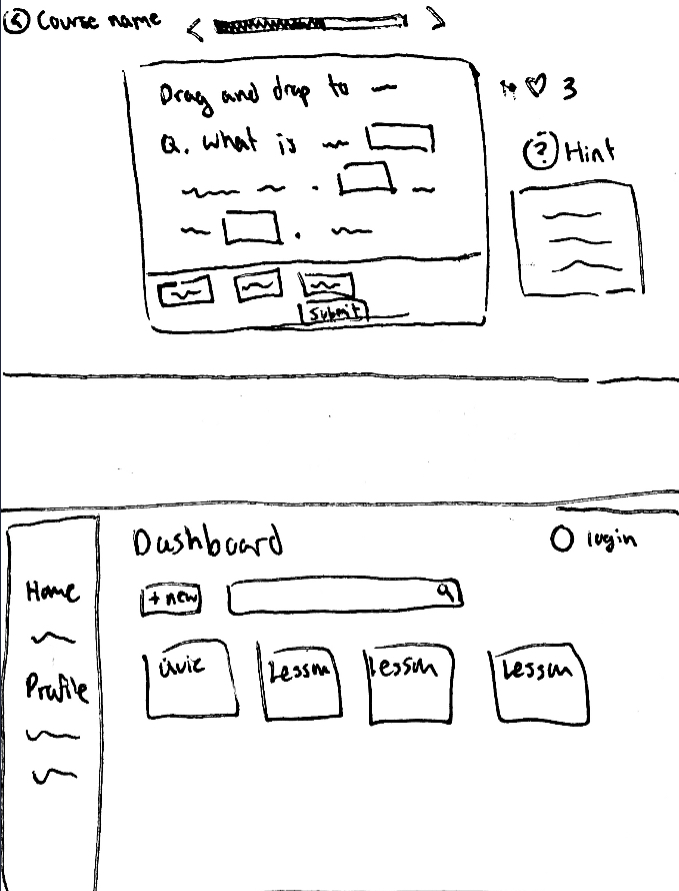

# Group 14 - StudySwan

## Describe your topic/interest in about 150-200 words

We are interested in creating a tool for students and learners who want to develop and/or reinforce their understanding and knowledge of various subjects. This web application will allow users to generate interactive lessons from images or PDFs (provided by the user) to support their education and studies through personalized and engaging learning experiences.

The application will store data such as created lessons, user profile information, and progress metrics like streaks and leagues. A user can upload some educational materials in the form of images or PDFs and will receive personalized and gamified lessons on this subject/materials. Users will then be able to learn from these lessons through different question formats including true/false questions, fill in the blanks, multiple choice, and long answer questions. They will also be able to track their progress over time.

Depending on time constraints, other additional functionalities may include diagram-based questions, real-time multiplayer modes, and a community feature for discussion and lessons sharing which may further enhance the learning experience.

This project aims to be a comprehensive tool for learners to deepen their understanding of certain subject matters and retain information more effectively.

## Minimal Requirement Breakdown

### 1. Have a working lesson for user to learn from.
- Develop the lesson flow.
- Create the starting and ending pages.
- Design the necessary implementation to generate questions using OpenAI.
- Manage responses for correct and incorrect answers.

### 2. Create dashboard menu for the lessons
- Design a dashboard interface for accessing different question modes and pages.
- Display all available lessons to the user.
- Enable functionalities to add, delete, and optionally edit questions.
- Show the user profile of the logged-in user.
- Incorporate a search functionality to find specific lessons from the dashboard.

## Project task requirements:
### 3-5 minimal requirements
- Working lesson with:
  - True/false
  - Fill in the blank
  - Multiple choice/select all that applies
  - Long answer (AI study buddy)
- User authentication and Profile
-  Streaks/Leagues (reward system of some kind)
- Home page/Menu
### 3-7 “standard” requirements
- Verbal exam
- Lesson of the day
- Hints/Explanations
- Lives
### 2-3 stretch requirements
- Diagram questions
- Real time multiplayer
- Community
- Leaderboard
- Stats

## Prototypes

## Team Members

- Daichi Furukawa: Currently in my fourth year, studying Cognitive Systems - Computational Intelligence & Design (CS Stream)! A fun fact about me is that I can name any (or at least most...) dinosaur from a picture!
- Emma Huang: I'm a Computer Science student going into my 3rd year this fall, and I like playing piano and hiking!
- Maggie Weng: I'm going into my third year as a Computer Science student and I like ducks and digital art.
- Antonia Tykei: I am second degree BCS student and I absolutely love the outdoors and crafting!

## Images

{You should use this area to add a screenshot of your app or website }

## References

{Add your stuff here}

